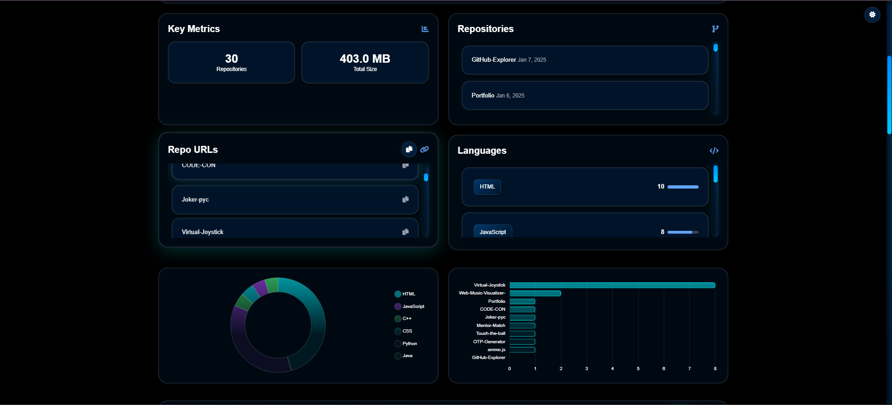

# 🚀 GitHub Explorer

[](./LICENSE)
[](https://github-explorer-mbqp.onrender.com)
[](https://github.com/Joker-pyc/github-explorer/issues)

**GitHub Explorer** is a powerful web application that provides comprehensive analysis of GitHub profiles and repositories. Dive deep into user activities, repository statistics, and coding patterns with our intuitive interface!

## 📸 Preview

<div align="center">
  
  <p><em>GitHub Explorer Dashboard showing profile analysis and repository statistics</em></p>
</div>

> 💡 Replace the placeholder image above with an actual screenshot of your application's dashboard

## 🌟 Key Features

- 🔍 **Comprehensive Profile Analysis**
  - User details and metadata visualization
  - Activity graphs and contribution history
  - Organization affiliations and followers/following metrics

- 📊 **Advanced Repository Analytics**
  - Star and fork statistics
  - Commit frequency graphs
  - Collaboration patterns
  - Code size and complexity metrics

- 🌐 **Language & Technology Insights**
  - Interactive language distribution charts
  - Framework and dependency analysis
  - Code quality indicators

- ⚡ **Performance & Security**
  - Smart API rate limit handling
  - Cross-origin request support
  - Secure token management
  - Caching for improved performance

## 🎯 Quick Start

### Prerequisites

- Node.js (v14 or higher)
- npm or yarn
- GitHub Personal Access Token

### Installation Steps

1. **Clone the Repository**
   ```bash
   git clone https://github.com/Joker-pyc/github-explorer.git
   cd github-explorer
   ```

2. **Install Dependencies**
   ```bash
   npm install
   ```

3. **Configure Environment**
   ```bash
   # Create .env file
   cp .env.example .env

   # Add your GitHub token and other configs
   PORT=3000
   GITHUB_API_TOKEN=your_github_personal_access_token
   ```

4. **Launch the Application**
   ```bash
   npm start
   ```

   Visit `http://localhost:3000` to see the application in action!

## 🔌 API Reference

### User Profile Endpoint

```http
GET /api/user/:username
```

#### Response Example

```json
{
  "user": {
    "login": "octocat",
    "name": "The Octocat",
    "avatar_url": "https://github.com/images/error/octocat_happy.gif",
    "bio": "GitHub mascot",
    "public_repos": 20,
    "followers": 1000
  }
}
```

### Repository Analytics Endpoint

```http
GET /api/repos/:username
```

#### Response Example

```json
{
  "repositories": [
    {
      "name": "awesome-project",
      "description": "An awesome project",
      "stars": 150,
      "forks": 30,
      "language": "TypeScript",
      "last_updated": "2024-01-07T12:00:00Z"
    }
  ],
  "analytics": {
    "total_stars": 500,
    "total_forks": 100,
    "language_distribution": {
      "TypeScript": 45,
      "JavaScript": 30,
      "Python": 25
    }
  }
}
```

## 💻 Development

### Project Structure

```
github-explorer/
├── public/
│   ├── css/
│   |    |── styles.css
|   |    └── chart.css
│   ├── js/
|   |    |── chart.js
|   |    |── toast.js
|   |    └── app.js
│   └── index.html
├── server.js
├── package.json
└── README.md
```

### Available Scripts

- `npm start`: Launch production server
- `npm run dev`: Start development server
- `npm test`: Run test suite
- `npm run lint`: Check code style
- `npm run build`: Build for production

## 🤝 Contributing

We welcome contributions! Here's how you can help:

1. **Fork the Repository**
2. **Create Your Feature Branch**
   ```bash
   git checkout -b feature/AmazingFeature
   ```
3. **Commit Changes**
   ```bash
   git commit -m 'Add some AmazingFeature'
   ```
4. **Push to Branch**
   ```bash
   git push origin feature/AmazingFeature
   ```
5. **Open a Pull Request**

### Contribution Guidelines

- Follow the existing code style
- Add unit tests for new features
- Update documentation as needed
- Reference relevant issues in commits

## 📝 License

This project is licensed under the MIT License - see the [LICENSE](./LICENSE) file for details.

## 👤 Author

**Santosh Maurya**

- 🌐 Portfolio: [joker-pyc.github.io/Portfolio](https://joker-pyc.github.io/Portfolio/)
- 📧 Email: [santoshmouriya1234567890@gmail.com](mailto:santoshmouriya1234567890@gmail.com)
- 💼 LinkedIn: [Santosh Maurya](https://www.linkedin.com/in/santosh-maurya-700630215/)
- 🐱 GitHub: [Joker-pyc](https://github.com/Joker-pyc)

## 🌟 Acknowledgments

- Thanks to the GitHub API team for providing excellent documentation
- Inspired by the amazing open-source community
- Special thanks to all our contributors

## 📞 Support

Having troubles? We're here to help!

- 📧 Email Support: [santoshmouriya1234567890@gmail.com](mailto:santoshmouriya1234567890@gmail.com)
- 🐛 Issue Tracker: [GitHub Issues](https://github.com/Joker-pyc/github-explorer/issues)
- 💬 Discussion Forum: [GitHub Discussions](https://github.com/Joker-pyc/github-explorer/discussions)

---

<div align="center">
  Made with ❤️ by <a href="https://github.com/Joker-pyc">Santosh Maurya</a>
  <br>
  If you find this project helpful, please consider giving it a ⭐️!
</div>